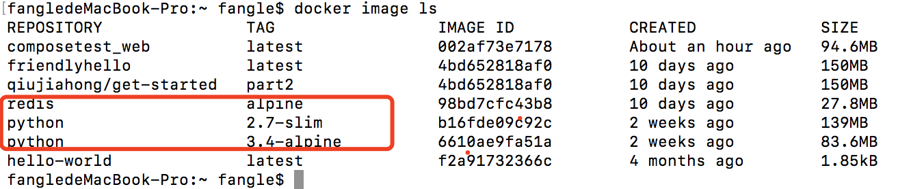

# docker compose快速开始

本文中，我们将会运行一个python应用，该应用使用Flask web框架，然后使用一个点击计数器统计网页点击的次数，并且返回在页面上。

## 准备工作

操作前需要确保我们已经在本机上安装好了docker 以及docker compose,我们不需要安装python以及redis环境。

## 操作步骤

### 建立相关文件

* 为项目创建文件夹  
```
$ mkdir composetest
$ cd composetest
```

* 创建python 文件，``vim app.py``

```py
import time

import redis
from flask import Flask


app = Flask(__name__)
cache = redis.Redis(host='redis', port=6379)


def get_hit_count():
    retries = 5
    while True:
        try:
            return cache.incr('hits')
        except redis.exceptions.ConnectionError as exc:
            if retries == 0:
                raise exc
            retries -= 1
            time.sleep(0.5)


@app.route('/')
def hello():
    count = get_hit_count()
    return 'Hello World! I have been seen {} times.\n'.format(count)

if __name__ == "__main__":
    app.run(host="0.0.0.0", debug=True)
```

* 在项目目录下创建文件``vim requirements.txt``  
```
flask
redis
```

### 创建DockerFile

* ``vim DockerFile``

```dockerfile
FROM python:3.4-alpine
ADD . /code
WORKDIR /code
RUN pip install -r requirements.txt
CMD ["python", "app.py"]
```


### 创建docker-compose.yml文件

* ``vim docker-compose.yml``,该compose文件定义了两个服务redis以及web

```yml
version: '3'
services:
  web:
    build: .
    ports:
     - "5000:5000"
  redis:
    image: "redis:alpine"
```

* web服务
  * 使用当前目录下的dockerfile
  * 暴露docker的5000端口映射到主机的5000端口上
* redis使用从github上拉去的公共的redis image。

### 使用docker compose编译运行

* 运行命令``docker-compose up``
* 在浏览器中访问``http://0.0.0.0:5000/``,应该能够看到如下内容。
```
Hello World! I have been seen 1 times.
```
* 刷新页面，应该可以看到：
```
Hello World! I have been seen 2 times.
```

* 切换到另外一个终端，运行命令``docker image ls``可以看到本地的镜像，可以使用命令``docker inspect <tag or id>``检查该镜像的详细信息。


* 可以在第二个命令窗口中输入``docker-compose down``结束应用，或者在第一个窗口中输入ctl+c即可；


### 编辑compose file添加一个绑定挂载

```yml
version: '3'
services:
  web:
    build: .
    ports:
     - "5000:5000"
    volumes:
     - .:/code
  redis:
    image: "redis:alpine"
```
其中 volumes关键字挂载项目目录（当前路径）到容器中的/code目录，这样我们可以修改代码而不需要重新编译image

* 启动应用``docker-compose up -d``,可以更新app.py的网页返回字段，刷新网页，可以看到该返回字段已经更新。
* 关闭应用，可以使用该命令``docker-compose down --volumes``，该命令可以删除redis 使用的data volume。


## 总结

* 相关命令
```
docker-compose up                  # 启动应用
docker-compose up -d               # 后台启动应用   
docker image ls                    # 列举镜像
docker-compose down                # 关闭应用
docker-compose down --volumes      # 关闭并删除相关volumes
docker inspect <tag or id>         # 查看镜像
```

* dockerfile例子

```dockerfile
FROM python:3.4-alpine
ADD . /code
WORKDIR /code
RUN pip install -r requirements.txt
CMD ["python", "app.py"]
```

* docker-compose.yml例子

```yml
version: '3'
services:
  web:
    build: .
    ports:
     - "5000:5000"
    volumes:
     - .:/code
  redis:
    image: "redis:alpine"
```

*  相关资源  
  * 该文翻译：https://docs.docker.com/compose/gettingstarted/
  * docker-compose 相关命令： https://docs.docker.com/compose/reference/
  