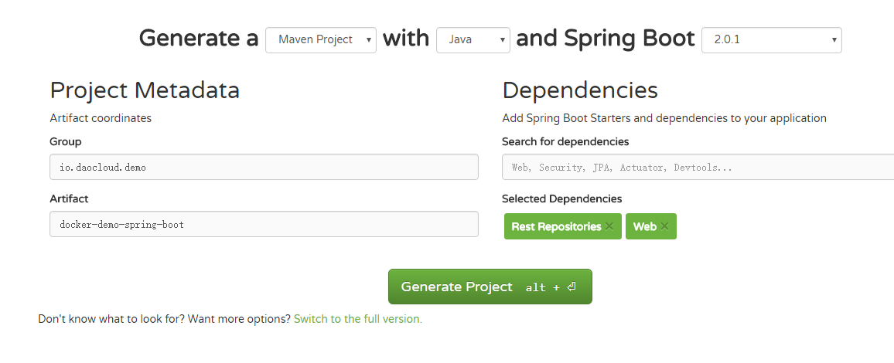

# 在Docker中使用 Java Spring Boot 框架

> 目标：用 Docker 的方式搭建一个 Java Spring Boot 应用


## 准备工作

操作前需要确保我们已经在本机上安装好了docker 以及docker compose

## 创建 Spring Boot 项目

* 访问 http://start.spring.io 站点，根据需要建立自己的应用,在 Dependencies 中填写 Web ，然后点击 Generate Project 按钮，将会下载回来一个基于 Maven 的项目模板。    


* 添加代码``\docker-demo-spring-boot\src\main\java\io\daocloud\demo\dockerdemospringboot\DockerDemoSpringBootApplication.java``    
```java
package io.daocloud.demo.dockerdemospringboot;

import org.springframework.boot.SpringApplication;
import org.springframework.boot.autoconfigure.SpringBootApplication;
import org.springframework.web.bind.annotation.RequestMapping;
import org.springframework.web.bind.annotation.RestController;

@RestController
@SpringBootApplication
public class DockerDemoSpringBootApplication {

	public static void main(String[] args) {
		SpringApplication.run(DockerDemoSpringBootApplication.class, args);
	}
	@RequestMapping("")
	public String hello(){
		return "Hello! Docker!";
	}
}

```

* 添加 Dockerfile
在应用根目录下建立 Dockerfile 文件，内容如下：

```Dockerfile
FROM maven:3.3.3

ADD pom.xml /tmp/build/
RUN cd /tmp/build && mvn -q dependency:resolve

ADD src /tmp/build/src
        #构建应用
RUN cd /tmp/build && mvn -q -DskipTests=true package \
        #拷贝编译结果到指定目录
        && mv target/*.jar /app.jar \
        #清理编译痕迹
        && cd / && rm -rf /tmp/build

VOLUME /tmp
EXPOSE 8080
ENTRYPOINT ["java","-Djava.security.egd=file:/dev/./urandom","-jar","/app.jar"]
```

因为 Spring Boot 框架打包的应用是一个包含依赖的 jar 文件，内嵌了 Tomcat 和 Jetty 支持，所以我们只需要使用包含 Java 的 Maven 镜像即可，不需要 Tomcat 镜像。  
为了减少镜像大小，在执行 Maven 构建之后，清理了构建痕迹。  
在 Dockerfile 文件的最后，使用 ENTRYPOINT  指令执行启动 Java 应用的操作。  
Dockerfile 具体语法请参考：[Dockerfile](https://docs.docker.com/engine/reference/builder/)。  

* 进入 Docker 的世界  
在一切准备好之后，在应用根目录执行如下命令，构建 Docker 镜像：    
```
docker build -t docker-demo-spring-boot . 
```
最后，让我们从镜像启动容器：   

```
docker run -d -p 8080:8080 docker-demo-spring-boot
```

打开浏览器，或者使用 curl 访问如下地址：
```
http://127.0.0.1:8080
```


## 总结

* 相关命令  
```
docker build -t docker-demo-spring-boot .             # 编译镜像
docker run -d -p 8080:8080 docker-demo-spring-boot    # 运行镜像
```


