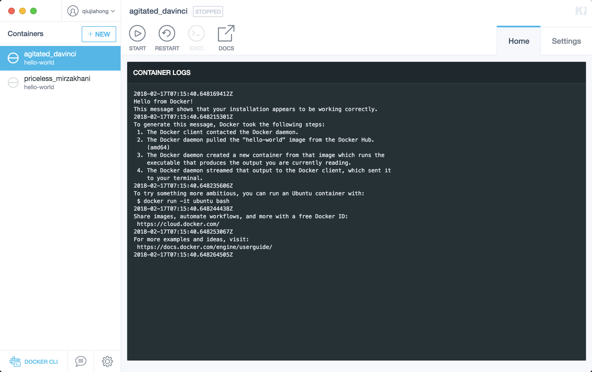

# 开始使用

## 检查版本

执行以下命令检查docker,docker-compose,docker-machine版本。

```
fangledeMacBook-Pro:~ fangle$ docker --version
Docker version 17.12.0-ce, build c97c6d6
fangledeMacBook-Pro:~ fangle$ docker-compose --version
docker-compose version 1.18.0, build 8dd22a9
fangledeMacBook-Pro:~ fangle$ docker-machine --version
docker-machine version 0.13.0, build 9ba6da9
fangledeMacBook-Pro:~ fangle$ 
```

## 使用应用执行例子

* 打开命令行，执行检查版本的命令确定docker正常运行；
* 执行以下命令启动一个docker服务器

    ```
    docker run -d -p 80:80 --name webserver nginx
    ```
    如果该命令没有在本地找到image，docker将会从docker hub下载最新的image. 
    命了执行完毕，可访问``http://localhost/``可以看到如下内容；
    

* 执行``docker ps``可以看到该镜像已经在运行状态：
    

* 停止并删除容器和镜像
    至此nginx webserver 将会持续在你的电脑上运行，直到你停止以及/或者删除该容器；如果需要停止webserver，可以键入命令``docker container stop webserver``
      
    停止了的容器将不会在``docker ps``命令中显示，我们可以使用``docker ps -a``命令查看。  
    如果需要删除容器，执行命令``docker container rm -f webserver``,这条命了将会删除容器，但是不会删除镜像，于是我们下次使用的时候将不会在docker hub上获取，而直接使用本地的镜像。要删除该镜像执行命令``docker image rm nginx``


## kitematic 

kitematic 是一个docker容器的gui管理器；

* 安装
    * 点击kitematic，弹出窗口安装kitematic
    
    
* 截图
    

## 更多常用的docker命令 

https://springframework.guru/docker-cheat-sheet-for-spring-devlopers/

