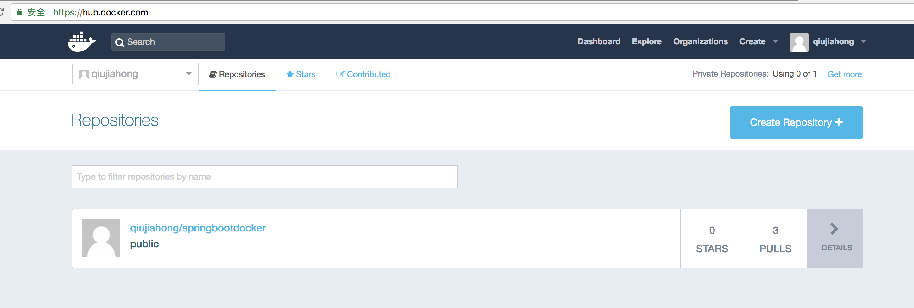

# 上传镜像到docker hub

## 设置账户

* 使用idea，pom.xml文件内右键 -> maven -> open 'settings.xml'

* 如下设置服务器,配置成自己真实的用户名和密码

```xml
<?xml version="1.0" encoding="UTF-8"?>
<settings xmlns="http://maven.apache.org/SETTINGS/1.0.0"
          xmlns:xsi="http://www.w3.org/2001/XMLSchema-instance"
          xsi:schemaLocation="http://maven.apache.org/SETTINGS/1.0.0 http://maven.apache.org/xsd/settings-1.0.0.xsd">

    <servers>
        <server>
            <id>docker.io</id>
            <username>username</username>
            <password>password</password>
        </server>
    </servers>
</settings>
```

* 执行命令上传

    ```
    [linux]$ mvn clean package docker:build docker:push
    ```

* 查看上传结果


